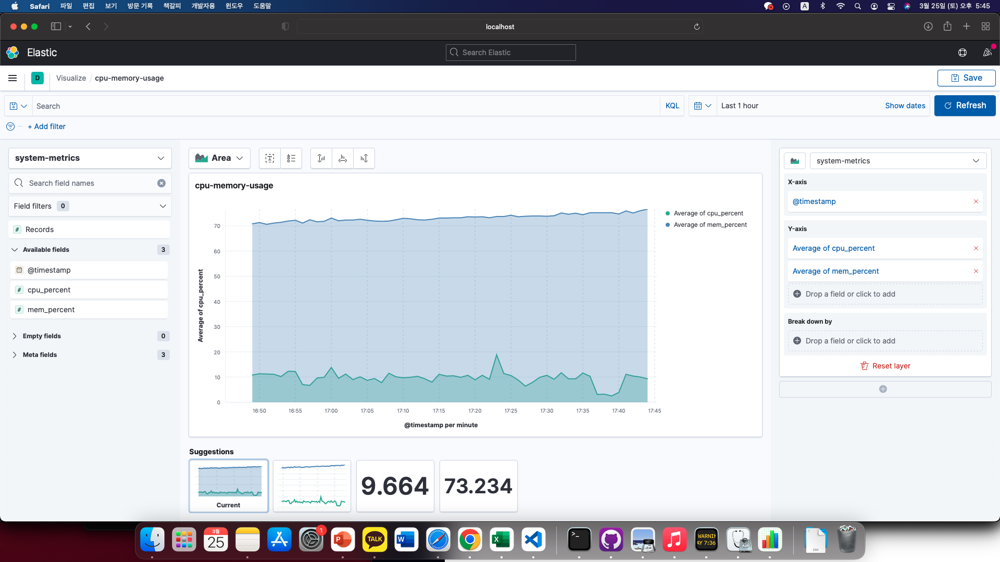

# Cash Hunter: 수익형 광고 어플리케이션

이 서비스를 사용하여 사용자는 유효한 광고를 찾을 수 있으며, 광고주는 광고 유효성을 검사하여 광고 효과를 높일 수 있습니다.

## 기술 스택

- Flask: 웹 서버 구현을 위한 Python 프레임워크
- Kafka: 분산 스트리밍 플랫폼으로, 메시지 브로커 역할을 수행하여 메시지 큐잉을 제공합니다.
- MySQL: 관계형 데이터베이스로, 사용자 포인트 업데이트와 기록을 위해 사용됩니다.
- MongoDB: NoSQL 데이터베이스로, 광고 유효성 검사 결과를 저장하기 위해 사용됩니다.
- Elasticsearch: 검색 및 분석 엔진으로, 시스템 메트릭 데이터를 수집하여 저장하는 데 사용됩니다.
- OpenCV: 영상처리 라이브러리로, 광고 사진과 사용자가 촬영한 이미지를 비교하는 데 사용됩니다.

## Workflow

1. 사용자는 Cash Hunter 모바일 앱을 사용하여 광고 사진을 촬영합니다.
2. 촬영된 이미지는 바이트 형태로 Flask 서버로 전송됩니다.
3. Flask 서버에서는 OpenCV 라이브러리를 사용하여 광고 사진과 사용자가 촬영한 이미지를 비교합니다. SIFT 알고리즘을 사용하여 두 이미지의 특징점을 찾고, FLANN 알고리즘을 사용하여 특징점 간의 매칭을 수행합니다.
4. 매칭된 특징점의 비율이 일정 수준 이상이면 Kafka Producer를 사용하여 광고가 유효하다는 메시지를 전송합니다. 그렇지 않으면 광고가 유효하지 않다는 메시지를 전송합니다.
5. Kafka Consumer는 유효한 광고 메시지를 수신하면 MongoDB 데이터베이스에 저장합니다.
6. MySQL 데이터베이스는 사용자의 포인트를 업데이트하고, 사용자의 포인트 기록을 기록합니다.
7. Elasticsearch는 Kafka Consumer에서 수신한 시스템 메트릭 데이터를 수집하여 저장합니다.

## What makes this a Data Engineering Project?

- 데이터 수집: LogStash와 system log data를 Kafka를 거쳐 수집하고, Elasticsearch에 저장하여 검색 및 분석이 가능하게 합니다.
- 데이터 저장: 신뢰성이 필요한 사용자 포인트 및 기록 데이터를 MySQL에 저장합니다. MongoDB에는 광고 유효성 검사 결과를 저장하고, Elasticsearch에는 시스템 메트릭 데이터를 저장합니다.
- 데이터 분석: MongoDB에 저장된 광고 유효성 검사 결과를 분석하여 광고의 성공 여부를 예측하거나 개선합니다.
- 데이터 시각화: Kibana를 이용하여 시스템 메트릭 데이터를 시각화하여 모니터링 결과를 시각화하여 분석합니다.

- ELK stack

